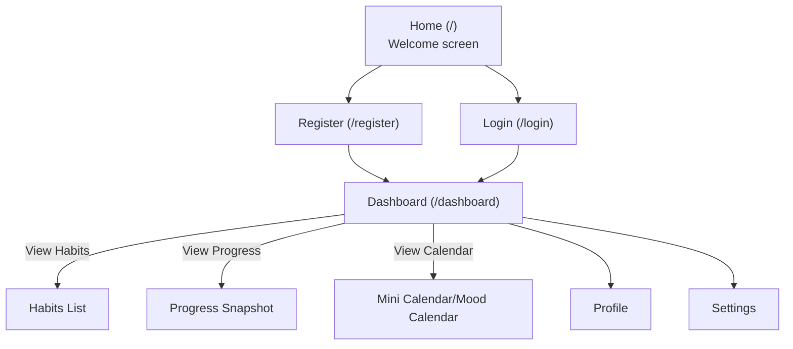
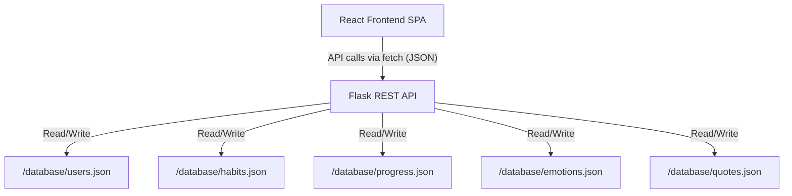
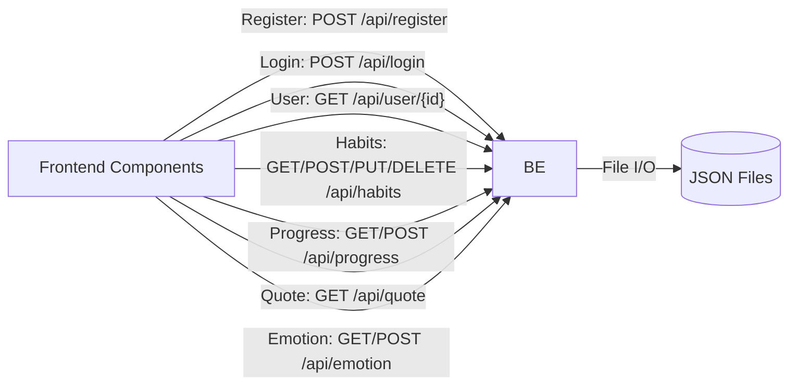

# HabitTrackerApp – Comprehensive Technical Documentation

---

## Table of Contents

1. **Overview**
2. **User Journey & Flow**
   - Home
   - Registration (Sign Up)
   - Login
   - Dashboard & Core Sections
3. **Frontend: Architecture & Components**
4. **Backend: Architecture, API, and File/DB Operations**
5. **Database & File Storage: Structure and Schema**
   - `emotions.json`
   - `quotes.json`
   - Other Data Files
6. **API Request/Response Patterns**
7. **Optimization & File/Directory Cleanup Recommendations**
8. **Appendix: Mermaid Diagrams**


---

## 1. Overview

HabitTrackerApp is a full-stack monolithic web application that enables users to build, track, and review positive habits. It is beginner-friendly and portable: the backend uses Python Flask with flat-file JSON storage (no database server required), while the frontend is a modern React app styled with a pastel and welcoming palette. The entire stack runs locally; there are no cloud or third-party integrations.

---

## 2. User Journey & Flow

### Home

- When a user accesses the site, they arrive at a visually appealing static homepage (`/`), with a header, sample habits, a motivational quote, and a single prominent "Register" button.
- Features pastel gradients, soft card layouts, and sample demo habits (visual only).

### Registration (Sign Up)

- Reached via the homepage or direct `/register` route.
- User submits name, email, and password.
- Registration is validated client-side, then sent to the backend (`/api/register`) as JSON.
- On success: users are autologged in, and redirected to `/dashboard`.
- On failure: validation or error messages are surfaced.

### Login

- Accessible at `/login`.
- User enters email and password.
- Successful authentication stores session/local storage data for the logged-in user and redirects to `/dashboard`.

### Dashboard & Core Sections

After authentication, users land at `/dashboard`, which features:

- **User Header:** Shows today's date, user's avatar/name, and a logout button.
- **Habits List Widget:** Shows active/tracked user habits.
- **Mini Calendar Widget:** Visualizes days with completed habits in the current month.
- **Progress Snapshot Widget:** Summarizes habit streaks, daily completions, and weekly percentages.
- **Quote of the Day Widget:** Rotates motivational quotes.
- **Calendar with Emotions:** Allows users to view/set daily moods with emoji, tracked over calendar days.
- **Navigation Placeholders:** Links exist for profile, new habit creation, full habits list, detailed progress, and settings. Some are implemented as placeholders pending full features, but routing is in place.

---

## 3. Frontend: Architecture & Components

### Structure

- Primary entrypoint: `frontend/src/index.js` (renders `<App />`).
- Routing handled by React Router:
    - `/`: HomePage (static)
    - `/register`: Register form
    - `/login`: Login form
    - `/dashboard`: Main dashboard (multiple widgets via composition)
    - `/dashboard/new-habit`, `/dashboard/habits`, `/dashboard/progress`, `/dashboard/profile`, `/dashboard/settings`: Render placeholders for future expansion.

### Main Components

- **App.js**: Defines all navigation, homepage, and sets up routes.
- **Dashboard.js**: Hosts user widgets (habits, progress, quote, calendar, etc.).
- **Register.js**: Registration form with client-server validation and navigation.
- **Login.js**: Login form handling credentials and routing.
- **UserHeader.js**: Shows user state and controls logout.
- **MiniCalendarWidget.js**: Monthly view of habit completions.
- **ProgressSnapshotWidget.js**: Analytical summary of recent habit progress.
- **QuoteOfTheDayWidget.js**: Fetches/display rotating quote from backend.
- **CalendarWithEmotions.js/lazy**: Presents, fetches, and updates daily mood with emoji.

### Component Data Flow

- Most widgets make direct REST API calls (`fetch`) to the backend at `/api/` with required user ID or data payloads.
- Session/local storage is used for keeping user state (used by UserHeader and elsewhere).
- CSS is modularized for dashboard widgets, themed globally for overall styles.


---

## 4. Backend: Architecture, API, and File/DB Operations

### Architecture

- Runs Python **Flask** (`app.py`) with `flask-cors` for all `/api/*` endpoints.
- **No database server**: all app data persists to `/database/*.json` (simple read/write).
- Entry point: `backend/app.py: create_app()` – sets all API routes and helpers.

### API Endpoints

(All routes under `/api/`)

- `POST /api/register`: Create new user.
- `POST /api/login`: Authenticate user.
- `GET /api/user/<user_id>`: Retrieve user profile.
- `GET /api/habits`: List all habits for user.
- `POST /api/habits`: Create a new habit.
- `PUT /api/habits/<habit_id>`: Update a habit.
- `DELETE /api/habits/<habit_id>`: Delete a habit.
- `GET /api/progress`: Get user’s daily habit completion progress.
- `POST /api/progress`: Submit/record completion for a day.
- `GET /api/quote`: Fetch a random (rotating) motivational quote.
- `GET /api/emotion`: Get daily user emotion log (as emoji, by date).
- `POST /api/emotion`: Store/update daily mood for a user.

### Request/Response Handling

- Input: JSON requests; user identification via ID in body/query/session storage.
- Output: Consistent JSON responses for all endpoints (success state, error state, and on errors).
- CORS allowed: The frontend can issue XHR to all `/api/*` endpoints from the browser.
- Error handling: Backend always returns structured JSON on errors, never raw HTML or traceback (if clean input).

### File/DB Operations

- Helper functions in backend handle all file interactions:
    - `read_json`/`write_json` for safe reading and overwriting JSON flat files.
    - All operations locked by user scope (only own user’s data accessible).
- Data files: All backend operations (users, habits, progress, quotes, emotions) are flat files under `/database`.

---

## 5. Database & File Storage: Structure and Schema

All persistent state is in JSON flat files (intended for local/demo deployment, not production security).

### `users.json`
- Stores all registered users.
    - Fields: `id`, `name`, `email`, `password` (plain), `avatar`, `join_date`

### `habits.json`
- Tracks user habits.
    - Fields: `id`, `user_id`, `name`, `schedule`, `streak`, etc.

### `progress.json`
- Tracks users’ day-to-day habit completions.
    - Data keyed by user and date.

### `emotions.json`
- Schema: Per-user, per-date mapping of mood emoji, e.g.:
    ```json
    {
      "1": {"2024-06-28": "😊", "2024-06-29": "😕"},
      "2": {"2024-06-24": "😄"}
    }
    ```
- _Current content_: file is initialized as empty (`{}`), to be filled in at runtime.

### `quotes.json`
- Array of objects with fields:
    - `text`: The inspirational message.
    - `author`: Attributed quote author.
    Example:
    ```json
    [
      {
        "text": "Motivation gets you going, but discipline keeps you growing.",
        "author": "John C. Maxwell"
      }
    ]
    ```

---

## 6. API Request/Response Patterns

### General Patterns

- **Request**: All API calls (except simple GETs) use JSON body. When creating or modifying data, the payload structure mirrors the fields needed for that resource.
- **Response**:
    - On success: `{ "success": true, <other_fields> }`
    - On error: `{ "success": false, "error": "<error message>" }`
    - On data GET: `{ "success": true, "data": { ... } }`
- **Authentication**: After login/register, user details/ID is placed in session/localStorage for subsequent requests. Most API requests require user ID to be present.

### Example Response

Successful registration:
```json
{ "success": true, "user": { "id": 7, "name": "Alice", ... } }
```
Failed login:
```json
{ "success": false, "error": "Invalid email or password" }
```
Habits fetch:
```json
{
  "success": true,
  "habits": [
    { "id": 1, "name": "Drink Water", ... }
  ]
}
```

---

## 7. Optimization & File/Directory Cleanup Recommendations

### Files/Directories to Remove or Refactor (Redundant/Obsolete)

- **`package.json.bak`, `requirements.txt.bak`** in root: Legacy backups, can be removed.
- **assets/design notes**: May be summarized in main documentation or retained for reference, but are not needed for deployment or runtime.
- **Mock/demo JSON (`frontend/src/quotes.json`)**: Only `/database/quotes.json` is used at runtime; demo file may be cleaned out if no longer needed for frontend-only static prototyping.
- **DashboardRoutesPlaceholders.js**: Replace with production-ready route components as implementation proceeds.
- **README files** under `database/`, `backend/`, `frontend/`: After centralizing documentation, individual folder readmes may be referenced or condensed.

### Additional Refactoring Suggestions

- Group all frontend static assets (images, icons) in a distinct `/assets` directory.
- Consider a `/api` or `/services` directory for future backend logic extraction.
- Move all style sheets to a single `/styles` directory for improved manageability.
- If scaling, transition to a real DB and optionally use ORM or API versioning for maintainability.

---

## 8. Appendix: Mermaid Diagrams

### a) High-level User Flow



### b) System Architecture



### c) API Endpoint Relationships



---

**End of HabitTrackerApp Comprehensive Technical Document**
